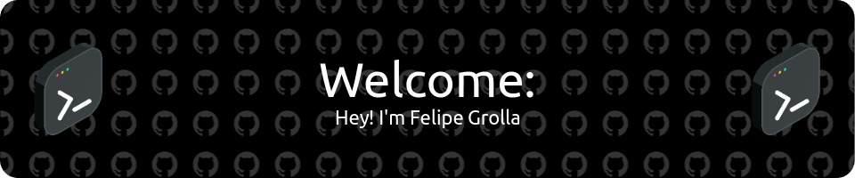

# 📊 My GitHub Stats:

  
  
   

# 

<h1>🚀 Programming portifolio (skills):</h1>

 
  
  
  
  
  
  
  
  
  
  
  

# 

  <h1 align="left">📝 Connect with me:</h1>
      

      
      
      
      
      
      

#

  
<h1>👨 More About Me: </h1>

  - 🇧🇷 I’m brazilian. 
  - 🧑🏻 I've 19 years 
  - 🎓 I’m currently studying on Pontifical Catholic University of Campinas. 
  - 🖥️ I'm currently graduating in Computer Engineering. 
  - 🗣️ Pronouns: he/him. 
  
    

#

<h1>Commits: </h1>
 
<picture align="center">
  <source media="(prefers-color-scheme: dark)" srcset="https://raw.githubusercontent.com/Grolla05/Grolla05/output/github-contribution-grid-snake-dark.svg">
  <source media="(prefers-color-scheme: light)" srcset="https://raw.githubusercontent.com/Grolla05/Grolla05/output/github-contribution-grid-snake-dark.svg">
  
</picture>
